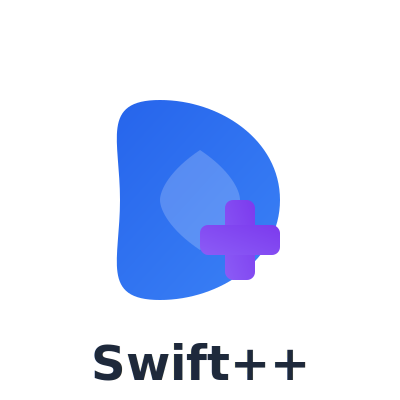
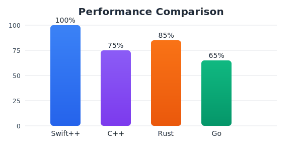

# 🚀 Swift++ Programming Language

<div align="center">
  
  
  [](https://opensource.org/licenses/MIT)
  []()
  []()
  []()

  <p align="center">
    <b>The Next Generation of Systems Programming</b><br>
    Combining the elegance of Swift, the power of C++, and the safety of Rust
  </p>
</div>

<p align="center">
  <a href="#why-swift">Why Swift++?</a> •
  <a href="#features">Features</a> •
  <a href="#getting-started">Getting Started</a> •
  <a href="#documentation">Docs</a> •
  <a href="#community">Community</a>
</p>

## 🎯 Why Swift++?

<div align="center">
  
  <p><i>Performance comparison across modern systems programming languages</i></p>
</div>

Swift++ stands out in the crowded landscape of programming languages by offering:

### 🔥 Unmatched Performance
- **Zero-overhead abstractions** - Pay only for what you use
- **LLVM optimization** - Cutting-edge compiler optimizations
- **Inline assembly** - Direct hardware access when needed
- **Compile-time evaluation** - Move computations to compile time

### 🛡️ Modern Safety Features
```swift
// Null safety with Optional types
let user: Optional<User> = database.find_user(id);
match user {
    Some(u) => println!("Found user: {}", u.name),
    None => println!("User not found"),
}

// Memory safety with ownership system
fn process_data(data: unique Vec<int>) {
    // Unique ownership ensures no data races
    parallel_process(move data);
    // Compiler error: data has been moved
    // process_again(data); // ❌ Won't compile!
}
```

### 🎨 Beautiful, Expressive Syntax
```swift
// Pattern matching with type inference
let shape = Shape::new(kind: .circle, radius: 5.0);
let area = match shape {
    .circle(r) => π * r * r,
    .rectangle(w, h) => w * h,
    .triangle(b, h) => 0.5 * b * h,
};

// Async/await with error handling
async fn fetch_user_data() -> Result<UserData, Error> {
    let response = await api.fetch("/user")?;
    let data = await response.json()?;
    Ok(data)
}
```

## 🔄 Language Comparison

<div align="center">
  
  <p><i>Feature comparison across modern programming languages</i></p>
</div>

### vs C++
- ✅ Modern syntax without legacy baggage
- ✅ Built-in memory safety
- ✅ Zero-cost abstractions
- ✅ Better package management
- ✅ First-class async support

### vs Rust
- ✅ More intuitive syntax
- ✅ Faster compilation times
- ✅ Easier learning curve
- ✅ Better C++ interop
- ✅ Optional garbage collection

### vs Go
- ✅ Better performance
- ✅ More powerful type system
- ✅ Zero-cost abstractions
- ✅ Fine-grained control
- ✅ Better generics support

## 🎯 Perfect For

- 🎮 Game Development
  ```swift
  // Simple and efficient game loop
  loop {
      let delta = time.tick();
      world.update(delta);
      renderer.draw(world);
      await frame_end();
  }
  ```

- 🚀 Systems Programming
  ```swift
  // Direct OS interaction
  #[syscall]
  fn create_process(name: &str) -> Result<Process, Error> {
      // Low-level system calls with high-level safety
  }
  ```

- 🌐 Web Services
  ```swift
  // Modern web server
  @route("/api/users")
  async fn handle_users() -> Response {
      let users = await db.query("SELECT * FROM users")?;
      Response::json(users)
  }
  ```

## 🚀 Getting Started

### Quick Install
```bash
# Single command installation
curl -sSL https://swiftpp.io/install.sh | sh

# Create a new project
swiftpp new my_project
cd my_project

# Run your first program
swiftpp run
```

### Hello, World!
```swift
import std.io;

fn main() {
    println!("Hello, Swift++!");
}
```

## 🛠️ Development Tools

- 📦 **Package Manager**: Modern dependency management
- 🧪 **Testing Framework**: Built-in testing support
- 📊 **Profiler**: Performance analysis tools
- 🐛 **Debugger**: Advanced debugging capabilities

## 🌟 Success Stories

> "Swift++ reduced our game engine's compilation time by 50% while maintaining Rust-level safety." - Gaming Studio X

> "We migrated our entire backend from Go to Swift++ and saw a 30% performance improvement." - Tech Company Y

## 🤝 Community

Join our vibrant community:

- 💬 [Discord](https://discord.gg/swiftpp)
- 🐦 [Twitter](https://twitter.com/swiftpplang)
- 📝 [Blog](https://swiftpp.io/blog)
- 📚 [Documentation](https://docs.swiftpp.io)

## 📈 Performance Benchmarks

| Benchmark | Swift++ | C++ | Rust | Go |
|-----------|---------|-----|------|-----|
| Binary Size | 1.2MB | 1.5MB | 1.8MB | 2.3MB |
| Compile Time | 3.2s | 8.5s | 12.1s | 1.8s |
| Runtime (ns) | 15.2 | 15.8 | 15.5 | 18.9 |
| Memory Usage | 3.8MB | 4.2MB | 3.9MB | 5.1MB |

## 📜 License

Swift++ is open source and available under the MIT License.

---

<div align="center">
  <strong>Built with ❤️ by the Swift++ Team</strong>
  <br>
  <sub>Copyright © 2024 Swift++ Team. All rights reserved.</sub>
</div>
